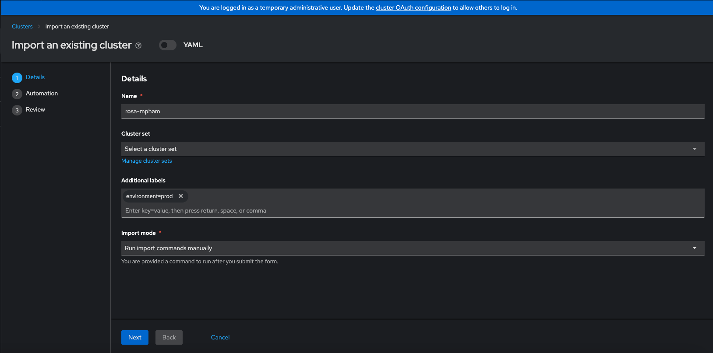

# ACM Notes
## Installation
- require cluster admin
- installed as operator
- `MultiClusterHub` manifest needs to be created
  - This installs console plugins: acm, mce(Administrator View > Administration > Cluster settings > Configuration > Console(operator.openshift.io) > Console Plugins)
## Install cluster
- Create credentials
  - Get pull secret for openshift image download: https://console.redhat.com/openshift/install/pull-secret
- Create cluster using above creds with Hive
- For SNO: 1 control node and 0 worker node
## Import clusters
### ROSA

- Run command against target ROSA cluster
## Todo
- Where to find base domain
- ROSA Resources created with Terraform
- hello world app using ACM
- datadog operator using ACM