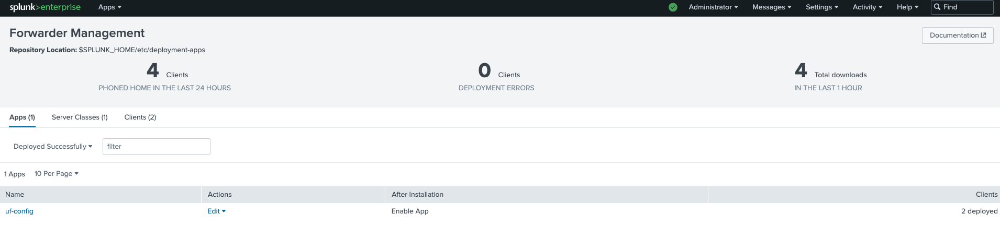
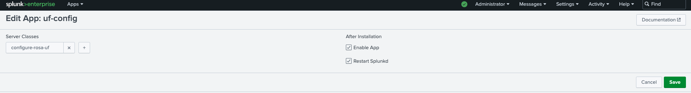
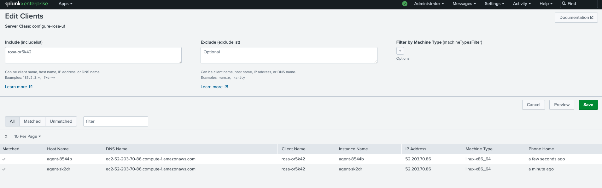

# Lab
## Splunk enterprise installation
- Using this repo: https://github.com/pnminh/terraform-aws-splunk
## Splunk universal forwarder
- [Used to forward logs to splunk](https://docs.splunk.com/Documentation/Forwarder/9.1.1/Forwarder/Abouttheuniversalforwarder)
- Step:
  - [Enable receiver](https://docs.splunk.com/Documentation/Forwarder/9.1.1/Forwarder/Enableareceiver)
  - [Install universal forwarder](https://docs.splunk.com/Documentation/Forwarder/9.1.1/Forwarder/Installanixuniversalforwarder)
  - [Configure universal forwarder to send data to receiver](https://docs.splunk.com/Documentation/Forwarder/9.2.0/Forwarder/Configuretheuniversalforwarder)
  ```
  $ ./splunk add forward-server <host name or ip address>:<listening port>
  $ ./splunk add monitor /var/log
  ```
## ROSA
### Setting up forwarder/deployment client on ROSA
- Using kustomize as example
- Run as DaemonSet
- The serviceaccount require privileged(root) access to retrieve logs from /var/log in the example
```
$ oc adm policy add-scc-to-user privileged  system:serviceaccount:splunk-agent:splunk-agent
```
### Setting up deployment server
#### Set up app
- Create new app from $SPLUNK_HOME/local/deployment-apps
```
$ mkdir $SPLUNK_HOME/local/deployment-apps/uf-config
```
creates an app called uf-config
- On the UI we can see the new app show up

- We should configure app to restart `splunkd` once changes take place. Go to Settings > Forward Management > Apps > App name > Edit

- Create a new server class that map the app to clients

The example above maps the `uf-config` app to all hosts with client name `rosa-or5k42`
- Add files to `$SPLUNK_HOME/local/deployment-apps/uf-config/default`, e.g. inputs.conf and outputs.conf. These files will be sent from deployment server to all clients
- (Optional) from deployment server, reload the changes so they can take effect quicker: 
```
$ $SPLUNK_HOME/bin/splunk reload deploy-server
```
- On the forwarder side, we can see the new app at `$SPLUNK_HOME/etc/apps`
```
$ ls $SPLUNK_HOME/etc/apps/uf-config/default/
inputs.conf  outputs.conf
```
### Troubleshooting
- Look for `$SPLUNK_HOME/var/log/splunkd.log` for forwarder's logs
- Use the commands
```
$ $SPLUNK_HOME/bin/splunk show config inputs
$ $SPLUNK_HOME/bin/splunk show config outputs
```
to get info about what are monitored(inputs-locations to capture and send logs) and target indexes(outputs)
